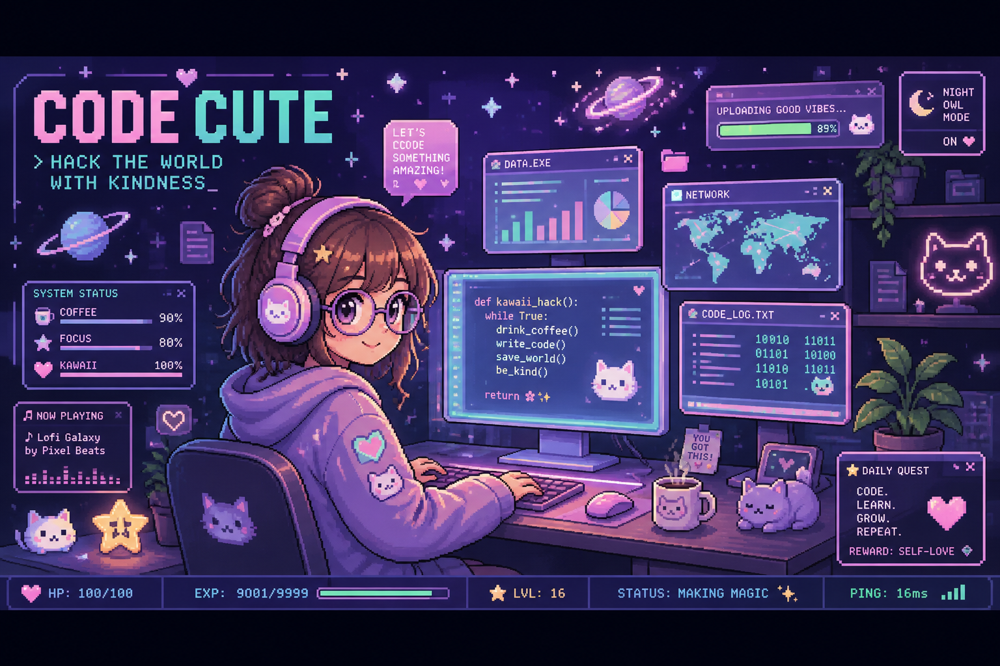

<!-- ✨🌸 Helga Ingrid Hochbauer · pixel-hearted data scientist 🌸✨ -->

<div align="center">

<!-- ========== HERO BANNER ========== -->


<br/>

<!-- ========== TYPING INTRO ========== -->
<a href="https://github.com/HelgaIngridHochbauer">
  
</a>

<br/>

<!-- ========== QUICK BADGES ========== -->


</div>

<br/>

<!-- ============================================================= -->
<!-- ========== ABOUT ME — GAME HUD PANEL ========== -->
<!-- ============================================================= -->

<div align="center">

```
╔══════════════════════════════════════════════════════════════╗
║  🎀  PLAYER PROFILE                                    LVL.16  ║
╠══════════════════════════════════════════════════════════════╣
║  NAME .......... Helga Ingrid Hochbauer                        ║
║  CLASS ......... Data Scientist 🧪 / Machine Learning Mage 🔮  ║
║  QUEST ......... Turning messy data into cute insights ✨      ║
║  ELEMENT ....... Pastel Pixels · Lofi Beats · Kind Code 💜     ║
║  SPECIAL ....... Making the scary stuff look adorable 🐱       ║
╚══════════════════════════════════════════════════════════════╝
```

</div>

<table>
<tr>
<td width="70%" valign="top">

### 🌸 `> about_me.py`

```python
class Helga:
    def __init__(self):
        self.name    = "Helga Ingrid Hochbauer"
        self.role    = "Data Scientist"
        self.loves   = ["data", "ML", "pixel art", "cats", "galaxies"]
        self.motto   = "Hack the world with kindness 💜"

    def current_focus(self):
        return [
            "🔬  Digging through data for hidden patterns",
            "🧠  Training models that actually behave",
            "📊  Making charts almost as cute as this readme",
            "🌱  Learning something new every single day",
        ]

    def say_hi(self):
        print("Let's build something amazing together! ✨")
```

</td>
<td width="30%" valign="top" align="center">


<sub>🐾 *my debugging assistant* 🐾</sub>

</td>
</tr>
</table>

<br/>

<!-- ============================================================= -->
<!-- ========== TECH STACK ========== -->
<!-- ============================================================= -->

<div align="center">

## 🎮 `INVENTORY` · Tech Stack

<sub>the tools in my adventure pack 🎒</sub>

<br/><br/>

**🐍 Languages**


**🧪 Data Science & ML**


**🗄️ Tools & Environments**


</div>

<br/>

<!-- ============================================================= -->
<!-- ========== STATS ========== -->
<!-- ============================================================= -->

<div align="center">

## 📊 `STATS SCREEN`


<br/><br/>


</div>

<br/>

<!-- ============================================================= -->
<!-- ========== SNAKE GAME ANIMATION ========== -->
<!-- ============================================================= -->

<div align="center">

## 🐍 `MINI-GAME` · Contribution Snake

<sub>watch the snake nibble my commits! 🎮 (auto-updates via GitHub Actions)</sub>

<br/>

<picture>
  <source media="(prefers-color-scheme: dark)" srcset="https://raw.githubusercontent.com/HelgaIngridHochbauer/HelgaIngridHochbauer/output/github-contribution-grid-snake-dark.svg" />
  <source media="(prefers-color-scheme: light)" srcset="https://raw.githubusercontent.com/HelgaIngridHochbauer/HelgaIngridHochbauer/output/github-contribution-grid-snake.svg" />
  
</picture>

</div>

<br/>

<!-- ============================================================= -->
<!-- ========== CONNECT ========== -->
<!-- ============================================================= -->

<div align="center">

## 🌌 `CONNECT` · Find Me In The Galaxy


<br/>

Let's team up! Send a message across the stars 💫

<a href="https://www.linkedin.com/in/helga-ingrid-hochbauer-54a8802b3/">
  
</a>
<a href="mailto:helga.hochbauer@yahoo.com">
  
</a>

<br/><br/>

```
  ✧･ﾟ: *✧･ﾟ:*  thanks for visiting my little corner of the universe  *:･ﾟ✧*:･ﾟ✧
              may your code compile & your coffee stay warm ☕💜
```

<sub>⭐ *be kind · stay curious · keep building* ⭐</sub>

</div>
